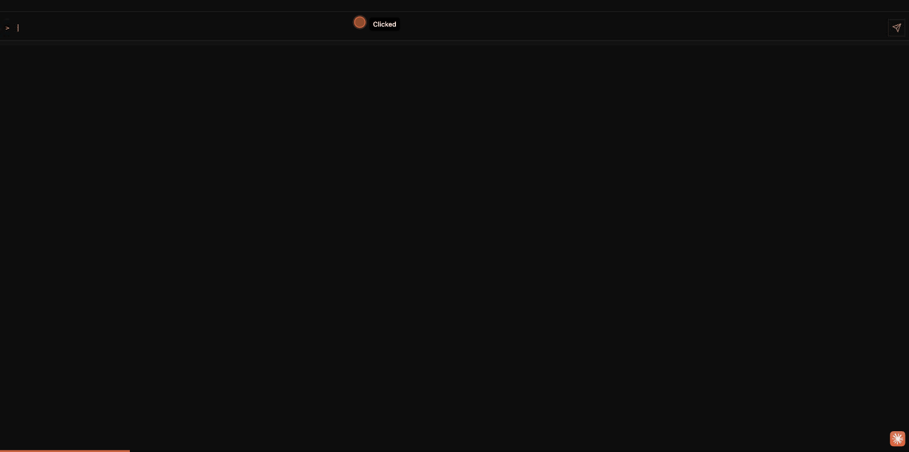
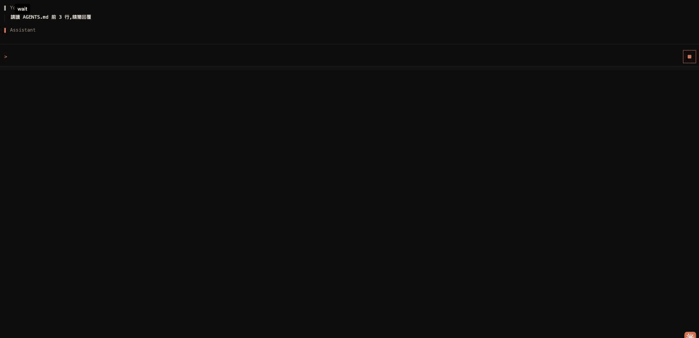
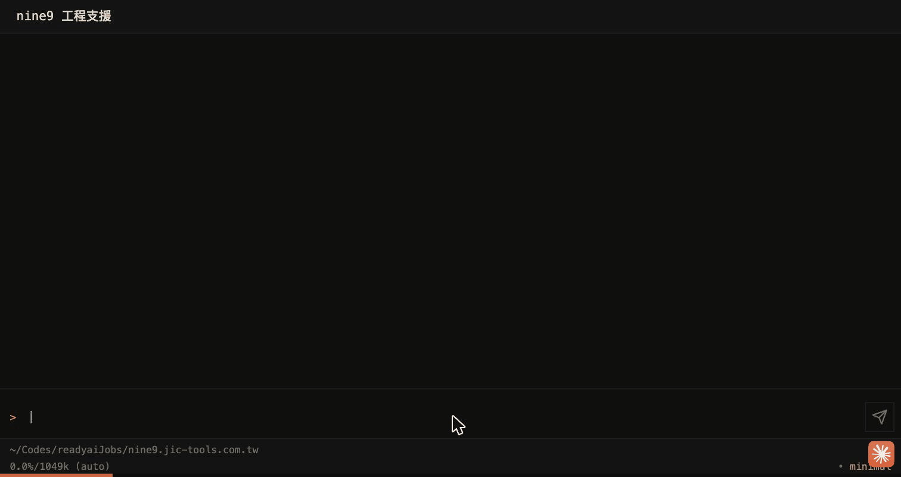
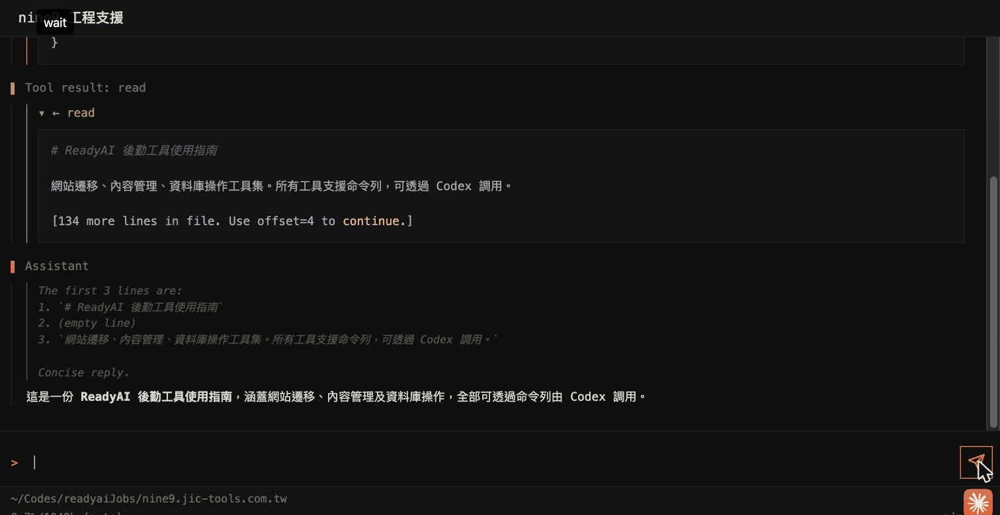
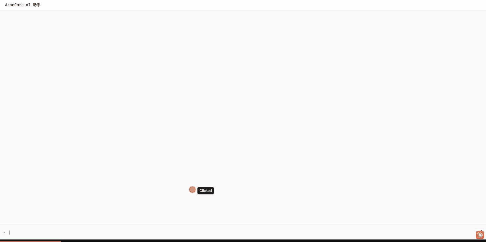
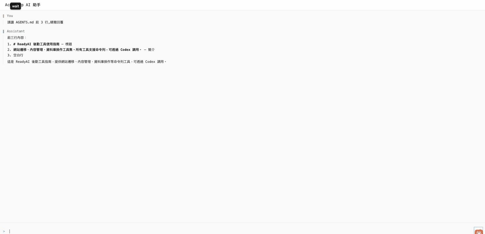

# Profile 角色介面 Screencast

pi-webui 的 `--profile <name>` 旗標把整套 UI 行為(隱藏哪些區塊、tool 進度怎麼說、要不要套 brand)綁成一個 toml 設定檔。這份文件用三段 GIF + 三張「tool 調用瞬間」對照圖,展示三個典型角色:**內建 customer**、**自訂 staff**、**完整 brand**。

> profile 系統最關鍵的設計目標就是「同一個 tool 調用,不同角色看到不同程度的細節」 — 客戶看到極簡狀態、員工看到中文化完整 tool block、OEM 看到品牌一致的純對話。每段都有 GIF(整段流程動畫)與靜態截圖(tool 調用瞬間)對照。

啟動方式:`cd <project> && pi-webui --profile <name>` — 自動讀取 `<project>/.pi/profiles/<name>.toml`。`customer` 沒有 toml 也能跑(內建 fallback)。

---

## 1. customer(內建 fallback)



**訴求**:給終端客戶看的最精簡介面。不需要任何 toml 檔。

```bash
pi-webui --profile customer
```

可見內容只有 composer 與 user/assistant 對話。看不到的東西:thinking、tool calls、status chips、session picker、model 名稱、cwd 路徑、token usage。送錯誤訊息經 `safe_errors` 包成 generic ticket。

對應內建設定:

```toml
[ui]
hide_thinking = true
hide_tool_calls = true
show_tool_progress = true   # 仍會顯示「正在處理...」spinner
hide_status_chips = true
hide_session_picker = true
hide_model = true
safe_errors = true
expose_tool_args = false
```

### tool 調用瞬間



`read` tool 正在執行中,但客戶**完全看不到** tool args、tool name 或 tool result — `hide_tool_calls=true` 把整個 tool block 隱形。唯一線索是右下角的 stop button(表示後台正在處理)。沒有 model chip、沒有 cwd 路徑、沒有 token usage,符合終端客戶介面的訴求。

---

## 2. staff(自訂 toml,工程支援)



**訴求**:內部員工 / 工程支援。看得到 thinking、tool args、tool result、model、cwd,但 brand 化:左上 `nine9 工程支援`、accent 換成橘色、tool 進度標籤中文化(GIF 中沒走到 progress 路徑因為 `hide_tool_calls=false` 直接渲染 tool block)。

`.pi/profiles/staff.toml`:

```toml
[meta]
description = "nine9 工程支援(內部員工接口)"

[ui]
show_tool_progress = true
hide_model = true   # 內部員工亦保密 model 名稱

[brand]
name = "nine9 工程支援"
accent = "#ff8c42"
mode = "dark"

[tool_labels.read]
start = "正在讀取 {file_basename}"
end = "讀取完成"

[tool_labels.bash]
start = "執行指令..."
end = ""

[tool_labels.WebFetch]
start = "抓取 {url_host}"
end = "抓取完成"

[tool_labels._default]
start = "處理中..."
end = ""
```

啟動:

```bash
pi-webui --profile staff
```

### tool 調用瞬間



員工看到的是**完整的 tool 調用流程**:tool args(`{ "path": "...AGENTS.md", "limit": 3 }`)、`Tool result: read` 完整展開帶 ReadyAI 後勤工具使用指南內容、然後 Assistant 開始 streaming final reply。雖然 `tool_labels.read.start = "正在讀取 {file_basename}"` 已設定,但因為 `hide_tool_calls=false` 直接渲染完整 tool block,所以 progress label 不會用上 — 那條中文化路徑是給 `hide_tool_calls=true` 場景準備的。右下角 `• minimal` 表示 effort 是 minimal,**但完全沒有 model 名稱**(`hide_model=true` 生效)、底部仍可見 cwd 路徑(`~/Codes/readyaiJobs/nine9.jic-tools.com.tw`)— 內部 debug 需要的細節都在。

---

## 3. brand(自訂 toml,完整接口模板)



**訴求**:OEM / 接口模板,完整覆蓋外觀。展示重點:`mode="light"` 切白底、`bg`/`panel`/`text`/`accent`/`border`/`muted` 六個 token 全套替換、brand name `AcmeCorp AI 助手`、所有細節 hide。

`.pi/profiles/brand.toml`:

```toml
[meta]
description = "完整 brand 接口模板(全套 token + light mode + 客戶介面)"

[ui]
hide_thinking = true
hide_tool_calls = true
show_tool_progress = true
hide_status_chips = true
hide_model = true
safe_errors = true

[brand]
name = "AcmeCorp AI 助手"
mode = "light"
bg = "#fafafa"
panel = "#ffffff"
text = "#1a1a1a"
accent = "#0ea5e9"
border = "#e5e7eb"
muted = "#6b7280"

[tool_labels.read]
start = "正在閱讀 {file_basename}"
end = "完成"

[tool_labels.bash]
start = "查詢資料..."
end = ""

[tool_labels._default]
start = "處理中..."
end = ""
```

啟動:

```bash
pi-webui --profile brand
```

### tool 調用瞬間



跟 customer 一樣 `hide_tool_calls=true`,但**完整套用 brand light mode**:白底、灰邊、`AcmeCorp AI 助手` brand chip 在左上、accent 換成 `#0ea5e9` 天藍色。客戶看到的是 OEM 一致的介面 — `read` tool 也跑了,但只看到 User → Assistant 的純對話,tool 過程完全隱形。整段沒有任何「pi-webui」「pi.dev」字樣外露,就像 AcmeCorp 自家做的產品。

`[brand]` 還支援 `logo`(SVG/PNG 相對路徑)與 `css`(額外 css overlay)兩個欄位,GIF 沒涵蓋但 schema 支援。

---

## 補充

- Profile schema 與 placeholder 白名單 (`{file_basename}` / `{url_host}` / `{progress_count}` / `{tool_arg.<key>}`) 見主 [README.md](../../../README.md) 的 `## profiles` 區塊
- 個別 CLI 旗標(如 `--brand-name`、`--hide-thinking`)仍可在 `--profile` 之後 override
- TOML 解析失敗或欄位未在白名單會 fail-fast,啟動立即 abort
- 錄製方式:Chrome MCP `computer` tool 觸發 click/type + `gif_creator` 抓 frame,每段 6–8 frames、1–2 秒
- 「tool 調用瞬間」靜態 PNG 是用 `magick profile-*.gif -crop ... +repage` 從對應 GIF 抽出代表性 frame、裁掉底部 chrome MCP 的 progress bar overlay 而成,所以左上會殘留一個小 `wait` action 標籤(無法乾淨去除,不影響示意)
